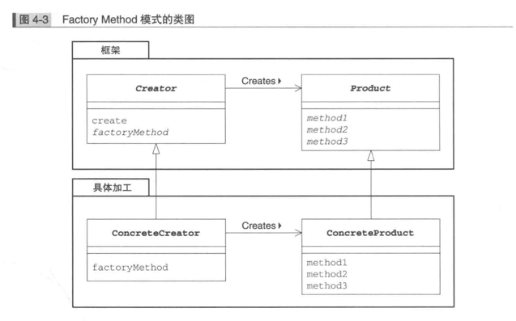

## 总体分类

### 创建型模式（ Creational Patterns ）
工厂模式、抽象工厂模式、单例模式、建造者模式、原型模式

### 结构型模式（ Structural Patterns ）
适配器模式
todo：
过滤器模式、装饰模式、享元模式、代理模式、外观模式、组合模式、桥接模式

### 行为型模式（ Behavioral Patterns ）
todo：
责任链模式、命令模式、中介者模式、观察者模式、状态模式、策略模式、模板模式、空对象模式、备忘录模式、迭代器模式、解释器模式、访问者模式

## Iterator模式 
- Iterator 迭代器，抽象程度更加高，负责按顺序逐个遍历元素的接口，一般就是hasNext、next两个方法
- ConcreteIterator 具体的迭代器
1. 实现iterator接口，具体的迭代器怎么去遍历集合
- Aggregate 集合
1. 官方定义:"该角色负责定义创建iterator角色的接口(API)。
这个接口是一个方法，会创建出"按照顺序访问保存在我内部元素的人”。在示例程序中，由Aggregate接口扮演这个角色，
它里面定义了iterator方法"
2. 该接口creates iterator接口，负责创建出，迭代器。
3. 迭代器本身只是一个存在，它具备迭代的功能，实际的类要去创造create这个迭代器，所以需要一个集合的接口
- ConcreteAggregate 具体的集合
1. 会创建出具体的Iterator 角色


## Adapter模式
- target 需求/目标方法、类
- adapter 适配器
- adaptee 被适配的对象

如果target是interface，adapter implements interface extends adaptee
如果target是抽象类，adapter只能单继承，adapter继承target，但是会has（包含）adaptee

当client使用的时候，返回的对象是target对象，不是适配器。
```
Print pb = new PrintBanner("hello");
```


- 关联的模式
1. Bridge模式
2. Decorator模式

## TemplateMethod模式
- AbstractClass抽象类
- ConcreteClass具体类

## FactoryMethod模式
- Product (产品) 产品具有的功能，持有的接口，具体的功能由ConcreteProduct角色决定
- ConcreteProduct (具体的产品) 角色属于具体加工这一方，它决定了具体的产品
- Creator(创建者) 负责生成product角色的抽象类，只需要调用produce角色和生成实例
- ConcreteCreator (具体的创建者)
在Factory Method模式中，父类决定实例的生成方式，但并不决定所要生成的具体的类，
具体的处理全部交给子类负责。这样就可以将生成实例的框架( framework )和实际负责生成实例的类解耦。



## Singleton模式
优点：不会频繁地创建和销毁对象，浪费系统资源。
使用场景：IO 、数据库连接、Redis 连接等。

## Prototype模式
- Prototype(原型)
- ConcretePrototype (具体的原型)
- Client(使用者)

## Builder模式
- Director 
1. 不关心具体的ConcreteBuilder，只调用builder中申明的方法
- Builder（建造者） 定义用于生成实例的接口API
- ConcreteBuilder（具体的建造者）在ConcreteBuilder 角色中还定义了获取最终生成结果的方法

client只使用了director construct方法
director只使用了builder的方法，它不知道具体的ConcreteBuilder是谁，不知道使用哪个builder的子类
Director类不知道自己使用的究竟是Bui1der类的哪个子类也好。
正是因为“只有不知道子类才能替换” 