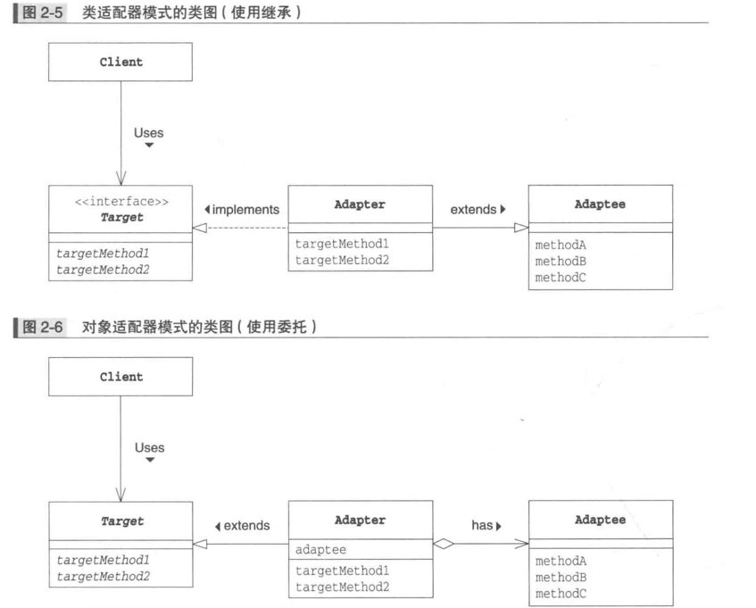
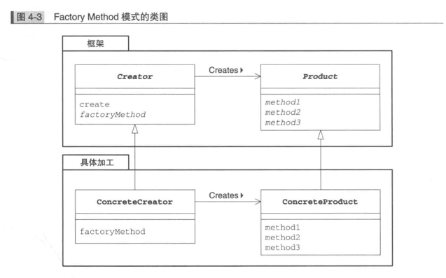
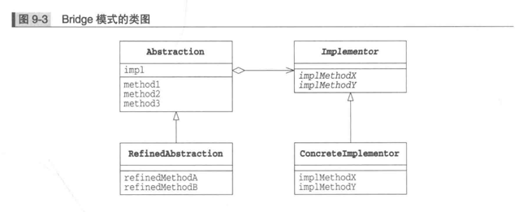

## 总体分类

很多设计模式都是试图将庞大的类拆分成更细小的类，然后再通过某种更合理的结构组装在一起。

### 创建型模式（ Creational Patterns ）

模式：工厂模式、抽象工厂模式、单例模式、建造者模式、原型模式

创建型模式主要解决对象的创建问题，封装复杂的创建过程，解耦对象的创建代码和使用代码。
1. 单例模式用来创建全局唯一的对象。
2. 工厂模式用来创建不同但是相关类型的对象（继承同一父类或者接口的一组子类），由给定的参数来决定创建哪种类型的对象。
3. 建造者模式是用来创建复杂对象，可以通过设置不同的可选参数，“定制化”地创建不同的对象。
4. 原型模式针对创建成本比较大的对象，利用对已有对象进行复制的方式进行创建，以达到节省创建时间的目的。

### 结构型模式（ Structural Patterns ）

适配器模式
过滤器模式、装饰模式、享元模式、代理模式、外观模式、组合模式、桥接模式

结构型模式主要总结了一些类或对象组合在一起的经典结构，这些经典的结构可以解决特定应用场景的问题。
结构型模式包括：代理模式、桥接模式、装饰器模式、适配器模式、门面模式、组合模式、享元模式。

- 代理模式：代理模式在不改变原始类接口的条件下，为原始类定义一个代理类，主要目的是控制访问，而非加强功能，这是它跟装饰器模式最大的不同。
- 桥接模式：桥接模式的目的是将接口部分和实现部分分离，从而让它们可以较为容易、也相对独立地加以改变。
- 装饰器模式：装饰者模式在不改变原始类接口的情况下，对原始类功能进行增强，并且支持多个装饰器的嵌套使用。
- 适配器模式：适配器模式是一种事后的补救策略。适配器提供跟原始类不同的接口，而代理模式、装饰器模式提供的都是跟原始类相同的接口。

### 行为型模式（ Behavioral Patterns ）
todo：
责任链模式、命令模式、中介者模式、观察者模式、状态模式、策略模式、模板模式、空对象模式、备忘录模式、迭代器模式、解释器模式、访问者模式

### 创建、定义、使用
做什么和怎么做是应该解藕的，使用者并不关心具体的细节。

## Iterator模式 
- Iterator 迭代器，抽象程度更加高，负责按顺序逐个遍历元素的接口，一般就是hasNext、next两个方法
- ConcreteIterator 具体的迭代器
1. 实现iterator接口，具体的迭代器怎么去遍历集合
- Aggregate 集合
1. 官方定义:"该角色负责定义创建iterator角色的接口(API)。
这个接口是一个方法，会创建出"按照顺序访问保存在我内部元素的人”。在示例程序中，由Aggregate接口扮演这个角色，
它里面定义了iterator方法"
2. 该接口creates iterator接口，负责创建出，迭代器。
3. 迭代器本身只是一个存在，它具备迭代的功能，实际的类要去创造create这个迭代器，所以需要一个集合的接口
- ConcreteAggregate 具体的集合
1. 会创建出具体的Iterator 角色


## Adapter模式
- target 需求/目标方法、类
- adapter 适配器
- adaptee 被适配的对象

如果target是interface，adapter implements interface extends adaptee
如果target是抽象类，adapter只能单继承，adapter继承target，但是会has（包含）adaptee

当client使用的时候，返回的对象是target对象，不是适配器。
```
Print pb = new PrintBanner("hello");
```


- 关联的模式
1. Bridge模式
2. Decorator模式

## TemplateMethod模式
- AbstractClass抽象类
- ConcreteClass具体类

### 模板模式裂解
模板方法模式在一个方法中定义一个算法骨架，并将某些步骤推迟到子类中实现。
模板方法模式可以让子类在不改变算法整体结构的情况下，重新定义算法中的某些步骤。
这里的“算法”，我们可以理解为广义上的“业务逻辑”，并不特指数据结构和算法中的“算法”。
这里的算法骨架就是“模板”，包含算法骨架的方法就是“模板方法”，这也是模板方法模式名字的由来。在模板模式经典的实现中，模板方法定义为 final，可以避免被子类重写。
需要子类重写的方法定义为 abstract，可以强迫子类去实现。不过，在实际项目开发中，模板模式的实现比较灵活，以上两点都不是必须的。

### 模板模式作用
模板模式有两大作用：复用和扩展。
1. 复用指的是，所有的子类可以复用父类中提供的模板方法的代码。
2. 扩展指的是，框架通过模板模式提供功能扩展点，让框架用户可以在不修改框架源码的情况下，基于扩展点定制化框架的功能。

### 实际使用
1. servlet中的使用，doservice(),doget(),dopost()
2. 模板方法就是定义一个流程，每个流程结点可变的就是一个抽象spi，由不同实现去现。
   解决的是一个复用与扩展问题。复用的是这个流程本身以及某些结点可以是默认实现。扩展的是有些结点是可以有不同实现的场景。
   回调是一种交互方式，由调用者告诉被调用者：你做完后还要做一个事情，这个事情是什么。然后被调用者做完后就可以做这个指定的事情。回调倒不用强制和模板方法概念合在一起。


## FactoryMethod模式
- Product (产品) 产品具有的功能，持有的接口，具体的功能由ConcreteProduct角色决定
- ConcreteProduct (具体的产品) 角色属于具体加工这一方，它决定了具体的产品
- Creator(创建者) 负责生成product角色的抽象类，只需要调用produce角色和生成实例
- ConcreteCreator (具体的创建者)
在Factory Method模式中，父类决定实例的生成方式，但并不决定所要生成的具体的类，
具体的处理全部交给子类负责。这样就可以将生成实例的框架( framework )和实际负责生成实例的类解耦。



## Singleton模式
优点：不会频繁地创建和销毁对象，浪费系统资源。
使用场景：IO 、数据库连接、Redis 连接等。

## Prototype模式
- Prototype(原型)
- ConcretePrototype (具体的原型)
- Client(使用者)

## Builder模式
- Director 
1. 不关心具体的ConcreteBuilder，只调用builder中申明的方法
- Builder（建造者） 定义用于生成实例的接口API
- ConcreteBuilder（具体的建造者）在ConcreteBuilder 角色中还定义了获取最终生成结果的方法

client只使用了director construct方法
director只使用了builder的方法，它不知道具体的ConcreteBuilder是谁，不知道使用哪个builder的子类
Director类不知道自己使用的究竟是Bui1der类的哪个子类也好。
正是因为“只有不知道子类才能替换”

以下三种情况可以使用builder模式：
- 我们把类的必填属性放到构造函数中，强制创建对象的时候就设置。如果必填的属性有很多，把这些必填属性都放到构造函数中设置，那构造函数就又会出现参数列表很长的问题。
如果我们把必填属性通过 set() 方法设置，那校验这些必填属性是否已经填写的逻辑就无处安放了。
- 如果类的属性之间有一定的依赖关系或者约束条件，我们继续使用构造函数配合 set() 方法的设计思路，那这些依赖关系或约束条件的校验逻辑就无处安放了。
- 如果我们希望创建不可变对象，也就是说，对象在创建好之后，就不能再修改内部的属性值，要实现这个功能，我们就不能在类中暴露 set() 方法。
构造函数配合 set() 方法来设置属性值的方式就不适用了。

2. 工厂模式是根据不同的条件生成不同Class的对象，构建者模式是根据不同参数生成一个class的不同对象。

## Bridge 模式
- Abstraction(抽象化) “类的功能层次结构” 的最上层，引用了lmplementor，该角色中保存了Implementor角色的实例
- RefinedAbstraction (改善后的抽象化) 对抽象类的功能进行新增
- lmplementor (实现者) 是抽象类，该角色位于“ 类的实现层次结构” 的最上层。
- Concretelmplementor(具体实现者) 该角色负责实现在Implementor 角色中定义的接口(API)

将抽象和实现解耦，让它们可以独立变化
这种模式只有M+N个类就可以描述所有类型，这就是M*N的继承类爆炸简化成了M+N组合。

对于第一种 GoF 的理解方式，弄懂定义中“抽象”和“实现”两个概念，是理解它的关键。定义中的“抽象”，指的并非“抽象类”或“接口”，而是被抽象出来的一套“类库”，它只包含骨架代码，真正的业务逻辑需要委派给定义中的“实现”来完成。而定义中的“实现”，也并非“接口的实现类”，而是一套独立的“类库”。“抽象”和“实现”独立开发，通过对象之间的组合关系，组装在一起。

### 委托关系
继承是强关联关系，委托是弱关联关系
要修改程序。这时，我们可以使用“ 委托” 来代替 “继承” 关系。
示例程序的Display类中使用了“委托”,Display类的impl字段保存了实现的实例，类的任务就发生了转移
- 调用open 方法会调用impl.rawprint()方法
- 调用print方法会调用impl.rawprint()方法
- 调用close方法会调用impl.rawclose()方法


### 类的功能层次结构
### 类的实现层次结构


## Strategy模式
- 创建、定义、使用
做什么和怎么做是应该解藕的，使用者并不关心具体的细节。

## Decorator模式

- Component 定义功能的核心角色
- ConcreteComponent 实现了Component角色所定义的接口的具体蛋糕
- Decorator(装饰物) 内部保存了被装饰对象 component角色，构造函数中也必须带上被装饰的对象
- ConcreteDecorator (具体的装饰物)


## Visitor 模式
- visitor (访问者)
1. 声明抽象方法，把具体的访问者的方法，变成抽象方法
- ConcreteVisitor(具体的访问者)
1. 具体的访问visit做得事情，它要实现所有的visit方法，即实现如何处理每个ConcreteElement角色。
2. 在示例程序中，由Li stvi si tor 类扮演此角色。 如同在ListVisitor中，currentdir 字段的值不断发生变化一样，随着visit(xxxxx)处理 的进行，ConcreteVisitor 角色的内部状态也会不断地发生变化。
- Element(元素)
1. Element角色表示Visitor角色的访问对象。
2. 它声明了接受访问者的accept方法。
3. accept 方法接收到的参数是Visitor角色。在示例程序中，由Element接口扮演此角色。
- ConcreteElement

### 双重分发
accept(接受)方法的调用方式如下。
element.accept(visitor);
而visit(访问)方法的调用方式如下。
visitor.visit (element);
对比一下这两个方法会发现，它们是相反的关系。element接受visitor，而visitor 又访问element
在Visitor模式中，ConcreteElement 和ConcreteVisitor 这两个角色共同决定了实际进行的处理。 
这种消息分发的方式一般被称为双重分发(doubledispatch)。


## Observer模式

### 场景
1. 原始需求：用户注册之后，送给用户体验金
2. 修改需求：用户注册之后，送给用户优惠券、发送邮件
3. 

